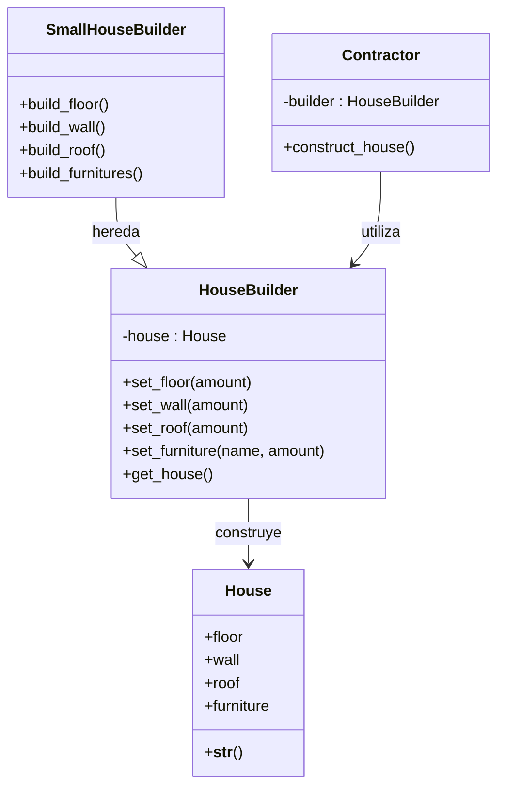

# 02_director_02.py

```mermaid
classDiagram
    class House {
        +floor
        +wall
        +roof
        +furniture
        +__str__()
    }

    class HouseBuilder {
        -house : House
        +set_floor(amount)
        +set_wall(amount)
        +set_roof(amount)
        +set_furniture(name, amount)
        +get_house()
    }

    class SmallHouseBuilder {
        +build_floor()
        +build_wall()
        +build_roof()
        +build_furnitures()
    }

    class Contractor {
        -builder : HouseBuilder
        +construct_house()
    }

    %% Relaciones entre clases
    HouseBuilder --> House : construye
    SmallHouseBuilder --|> HouseBuilder : hereda
    Contractor --> HouseBuilder : utiliza

```
