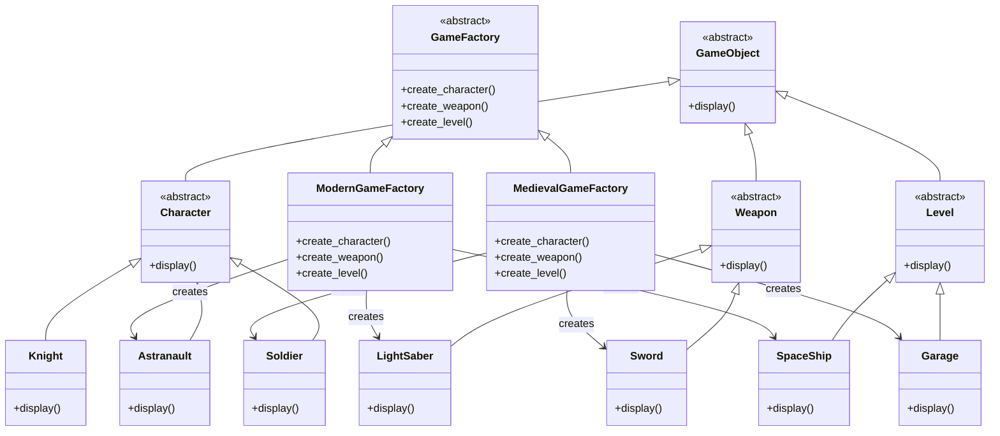

# 03_AbstractFactory/04_GameEngine_01.py

```mermaid
classDiagram
    %% Interfaces / Abstract classes
    class GameObject {
        <<abstract>>
        +display()
    }

    class Character {
        <<abstract>>
        +display()
    }

    class Weapon {
        <<abstract>>
        +display()
    }

    class Level {
        <<abstract>>
        +display()
    }

    class GameFactory {
        <<abstract>>
        +create_character()
        +create_weapon()
        +create_level()
    }

    %% Concrete Characters
    class Knight {
        +display()
    }

    class Astranault {
        +display()
    }

    class Soldier {
        +display()
    }

    %% Concrete Weapons
    class Sword {
        +display()
    }

    class LightSaber {
        +display()
    }

    %% Concrete Levels
    class Garage {
        +display()
    }

    class SpaceShip {
        +display()
    }

    %% Concrete Factories
    class ModernGameFactory {
        +create_character()
        +create_weapon()
        +create_level()
    }

    class MedievalGameFactory {
        +create_character()
        +create_weapon()
        +create_level()
    }

    %% Inheritance relationships
    GameObject <|-- Character
    GameObject <|-- Weapon
    GameObject <|-- Level

    Character <|-- Knight
    Character <|-- Astranault
    Character <|-- Soldier

    Weapon <|-- Sword
    Weapon <|-- LightSaber

    Level <|-- Garage
    Level <|-- SpaceShip

    GameFactory <|-- ModernGameFactory
    GameFactory <|-- MedievalGameFactory

    %% Optional: indicate that factories create products
    ModernGameFactory --> Astranault : creates
    ModernGameFactory --> LightSaber : creates
    ModernGameFactory --> SpaceShip : creates

    MedievalGameFactory --> Soldier : creates
    MedievalGameFactory --> Sword : creates
    MedievalGameFactory --> Garage : creates

```

