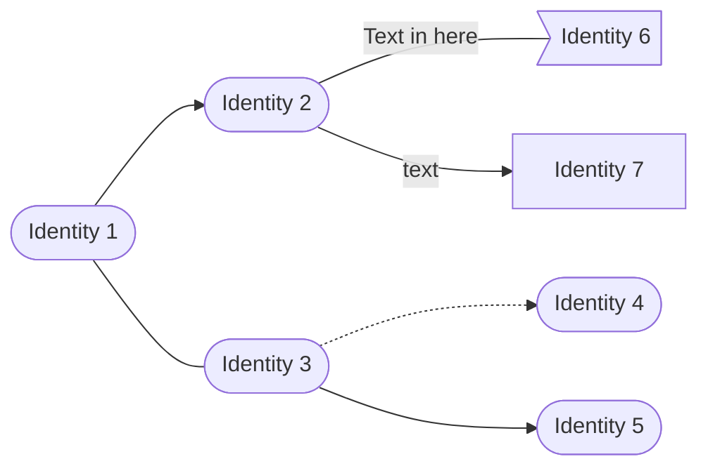
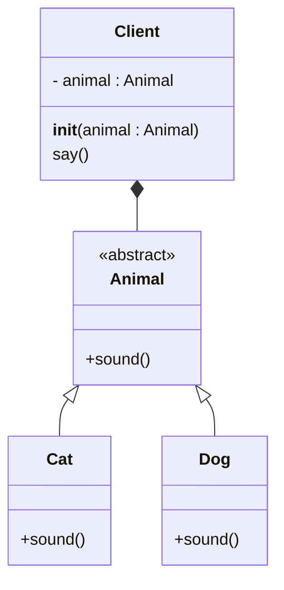

# Probando diferentes formatos de Mermaid

## Ejemplo #1:

```mermaid
flowchart LR
    id1(["Identity 1"])
    id2(["Identity 2"])
    id3(["Identity 3"])
    id4(["Identity 4"])
    id5(["Identity 5"])
    id6>"Identity 6"]
    id7["Identity 7"]

    id1 --> id2
    id1 --- id3
    id3 -.-> id4
    id3 --> id5
    id2 --Text in here--- id6
    id2 -->|text| id7

```

## Ejemplo #2:

```mermaid
classDiagram
    class Animal {
        +sound()
    }
    <<abstract>> Animal

    class Cat {
        +sound()
    }

    class Dog
    Dog : +sound()

    class Client {
        - animal : Animal
        __init__(animal : Animal)
        say()
    }

    Animal <|-- Cat
    Animal <|-- Dog
    Client *-- Animal


```
